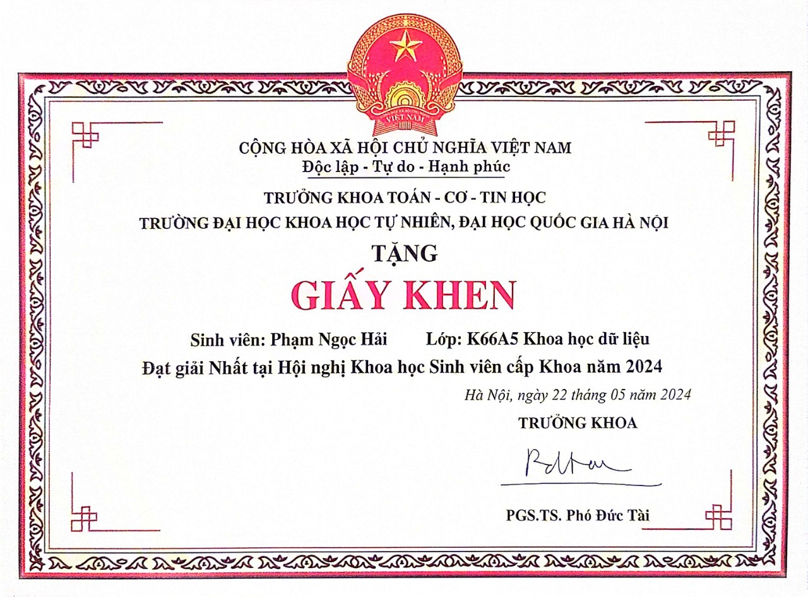
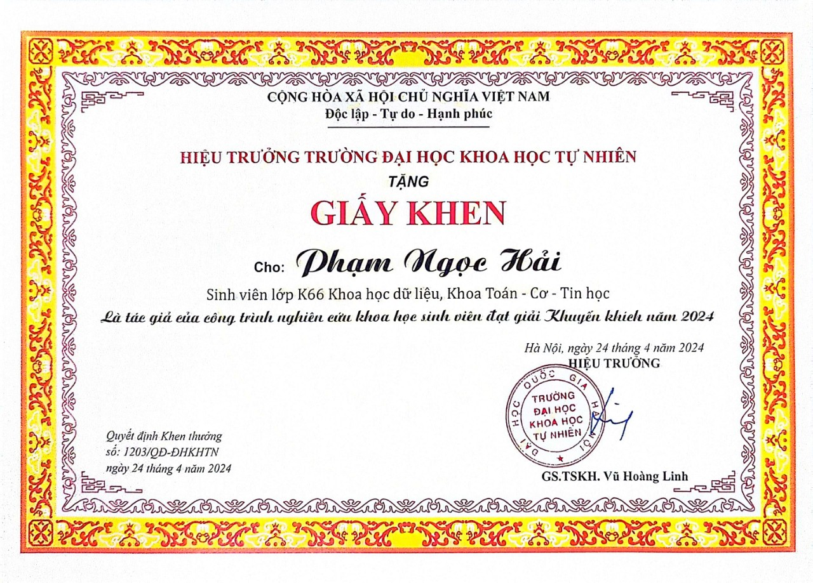
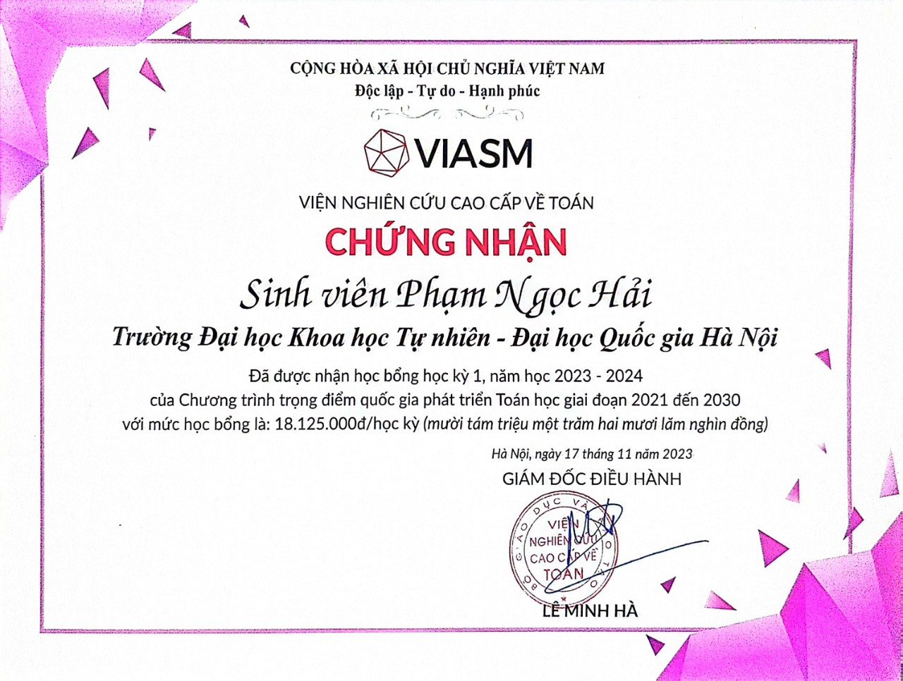
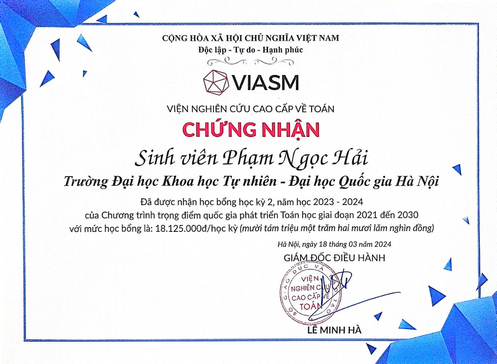

## Xin chào tôi là Phạm Ngọc Hải 👋

- 🌱 Hiện tại tôi đang học ngành Khoa học dữ liệu 
- 👯 Tôi đang tìm kiếm cơ hội thực tập về AI & Khoa học dữ liệu để áp dụng kiến thức đã học vào thực tế và học hỏi thêm từ các chuyên gia
- 📫 Để liên hệ với tôi: harito.work@gmail.com
  
## 🔧 Kỹ năng
  
- 💻 **Ngôn ngữ lập trình**: Python, Java, R, HTML/CSS, JavaScript, SQL, C++
- 🛠️ **Công cụ và công nghệ**: Tensorflow, Keras, Scikit-Learn, Matplotlib, Tkinter, VS Code, Git, MySQL, MongoDB, React, NodeJS, FastAPI, Spark, Kafka. Ngoài ra tôi đặc biệt yêu thích Linux, có thể tìm hiểu qua cách tôi sử dụng Arch Linux tại: https://github.com/Harito97/SetupArch
- 📊 **Lĩnh vực quan tâm**: AI, Machine Learning, Deep Learning, Data Analysis, Data Engineer, Data Scientist  
  
## 📂 Dự án
  
1. **Các bài toán phân loại hình ảnh**
- 🖼️ Sử dụng: SofMax Regression, SVM, Clustering, ANN, Convolutional Neural Networks (CNN)
- 📋 Mô tả:  
Xây dựng mô hình phân loại hình ảnh  
    - Tế bào học tuyến giáp từ bệnh viện Trung ương 108, phân nhãn theo thang chuẩn Bethesda. Đây là **dự án nghiên cứu khoahọc chính của tôi hiện tại và giúp tôi đạt giải**, chi tiết tại: https://github.com/Harito97/ThyroidCancer
    - Mô bệnh học dạ dày, phân loại Normal và Abnormal, chi tiết tại: https://github.com/Harito97/GasHisClassifier
    - Năm loài động vật, chi tiết tại: https://github.com/Harito97/AnimalClassifier
  
2. **Các dự án về Web & Phân tích dữ liệu**
- 📈 Sử dụng: ReactJS, HTML/CSS, JS, FastAPI, Scikit-Learn, Pandas, Matplotlib
- 📊 Mô tả: Dự án web cá nhân hóa không gian làm việc tại: https://github.com/Harito97/HaritoWork. Hay dự án web quản lý trường học: đăng ký học, thi, ... tại: https://github.com/Harito97/UniManager
  
3. **Bài toán theo dõi đối tượng nhiều nguồn**
- 🖼️ Sử dụng: YOLO, Kafka
- 📋 Mô tả: Theo dõi nhiều đối tượng từ nhiều camera, chi tiết tại: https://github.com/Harito97/SmartCameraSystem
  
Và còn 1 số dự án khác.
  
## 🏆 Một số thành tựu:
- Về hoạt động nghiên cứu khoa học  
    🥇 Giải Nhất nghiên cứu khoa học sinh viên cấp Khoa && Giải Kk nghiên cứu khoa học sinh viên cấp Trường
      

    
    

  
- Về kiến thức Toán học  
    📜 Được sự công nhận của chương trình Trọng điểm quốc gia phát triển Toán học
      

    
    

